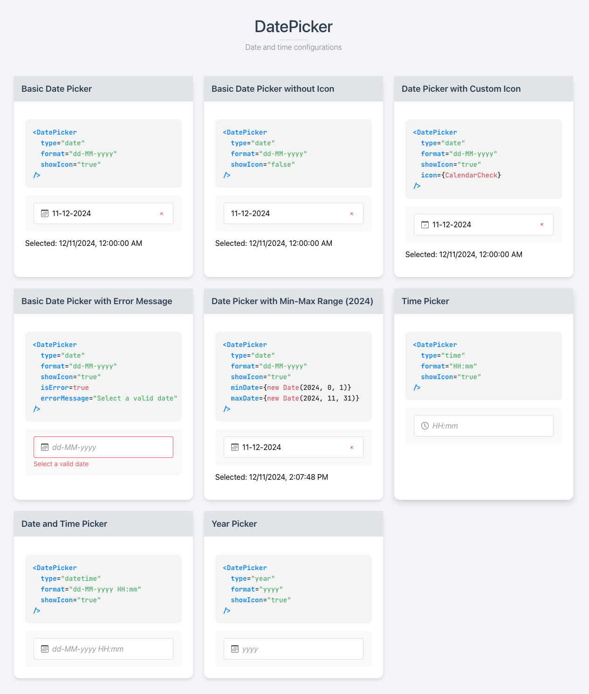

# DateTimePicker Component

This project showcases a versatile **DateTimePicker** React component with multiple configurations for date, time, and year selection.

---

## Table of Contents

1. [Overview](#overview)
2. [Features](#features)
3. [Getting Started](#getting-started)
4. [Component Props](#component-props)
5. [Usage Examples](#usage-examples)
6. [Customization](#customization)

---

## Overview



The **DateTimePicker** component provides an easy-to-use interface for selecting dates, times, or years, with options for error handling, range restrictions, and format customization. It is designed to support various use cases, such as:

- Simple date pickers
- Time pickers
- Combined date and time pickers
- Year selectors

The project demonstrates how to implement and customize this component using React.

---

## Features

- **Multiple Picker Types**: Supports `date`, `time`, `datetime`, and `year` selection.
- **Customizable Format**: Flexible date/time formats via `moment.js`.
- **Range Validation**: Restrict selections using `minDate` and `maxDate`.
- **Icons**: Built-in or custom icons for better UI.
- **Error Handling**: Display error messages for invalid inputs.
- **Clear Button**: Reset selected values easily.

---

## Getting Started

### Prerequisites

- **Node.js** and **npm** installed on your machine.
- Familiarity with **React**.

### Installation

1. Clone this repository:
   ```bash
   git clone https://github.com/your-repo/datetime-picker.git
   cd datetime-picker
   ```
2. Install dependencies:
   ```bash
   npm install
   ```
3. Run the development server:
   ```bash
   npm start
   ```
   Access the app at `http://localhost:3000`.

---

## Component Props

| Prop Name      | Type                      | Default           | Description                                                                                      |
|----------------|---------------------------|-------------------|--------------------------------------------------------------------------------------------------|
| `type`         | `'date' | 'time' | 'datetime' | 'year'` | `'datetime'`     | Defines the picker type (date, time, datetime, or year).                                         |
| `format`       | `string`                  | `'yyyy-MM-dd'`    | Format of the displayed value (e.g., `HH:mm`, `yyyy-MM-dd HH:mm`).                              |
| `placeholder`  | `string`                  | `'Select date and time'` | Placeholder text for the input field.                                                           |
| `disabled`     | `boolean`                | `false`           | Disables the picker.                                                                             |
| `defaultValue` | `Date`                    | `null`            | Sets the initial date value.                                                                    |
| `showIcon`     | `boolean`                | `false`           | Toggles visibility of the picker icon.                                                          |
| `icon`         | `React.ComponentType`     | `null`            | Custom icon component.                                                                           |
| `minDate`      | `Date`                    | `null`            | Minimum selectable date.                                                                        |
| `maxDate`      | `Date`                    | `null`            | Maximum selectable date.                                                                        |
| `isError`      | `boolean`                | `false`           | Displays error message when set to `true`.                                                      |
| `errorMessage` | `string`                  | `''`              | Error message text.                                                                              |
| `onChange`     | `(date: Date or null) => void` | `undefined`      | Callback triggered when the selected value changes.                                             |

---

## Usage Examples

### Basic Date Picker

```jsx
<DateTimePicker type="date" showIcon format="yyyy-MM-DD" />
```

### Time Picker

```jsx
<DateTimePicker type="time" format="HH:mm" placeholder="Select Time" />
```

### DateTime Picker with Range

```jsx
<DateTimePicker 
  type="datetime" 
  format="yyyy-MM-DD HH:mm" 
  minDate={new Date(2024, 0, 1)} 
  maxDate={new Date(2024, 11, 31)} 
/>
```

### Year Picker

```jsx
<DateTimePicker type="year" format="YYYY" placeholder="Select Year" />
```

---

## Customization

The component supports custom icons by passing an icon component through the `icon` prop. For example:

```jsx
import { CustomIcon } from './icons';

<DateTimePicker type="date" icon={CustomIcon} />
```

Additionally, styles can be customized by overriding the default CSS classes in the `styles/App.scss`.

---

## Live Demo Cards

The app includes a grid of cards showcasing different configurations of the **DateTimePicker**. Each card demonstrates:

1. A **preview** of the component.
2. A **code snippet** showing how to implement the configuration.
3. The **selected value** after user interaction.

### Demo Configurations

1. **Basic Date Picker**  
   - **Props**: `type="date"`, `showIcon=true`.
   - Displays a standard date picker with a calendar icon.

2. **Date Picker Without Icon**  
   - **Props**: `type="date"`, `showIcon=false`.  
   - Simple date picker without an icon.

3. **Date Picker with Error Handling**  
   - **Props**: `type="date"`, `isError=true`, `errorMessage="Select a valid date"`.  
   - Highlights input errors.

4. **Date Picker with Range (2024)**  
   - **Props**: `type="date"`, `minDate=2024-01-01`, `maxDate=2024-12-31`.  
   - Restricts selection to dates in 2024.

5. **Time Picker**  
   - **Props**: `type="time"`, `format="HH:mm"`.  
   - Allows selection of time only.

6. **Date and Time Picker**  
   - **Props**: `type="datetime"`, `format="yyyy-MM-DD HH:mm"`.  
   - Enables selection of both date and time.

7. **Year Picker**  
   - **Props**: `type="year"`, `format="YYYY"`.  
   - Simplifies selection of a specific year.
